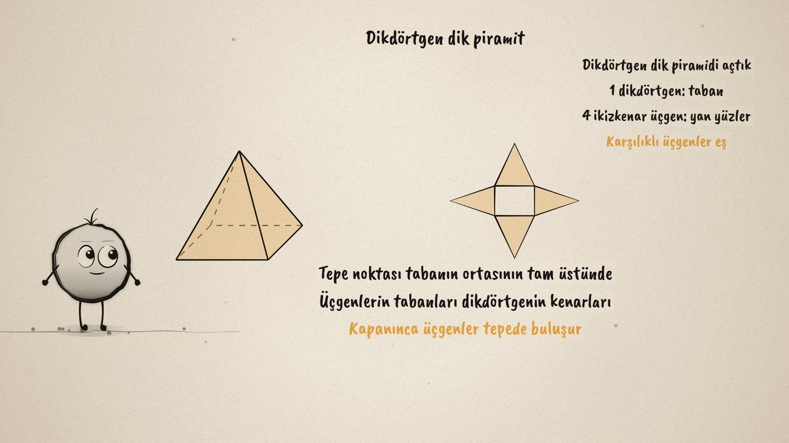
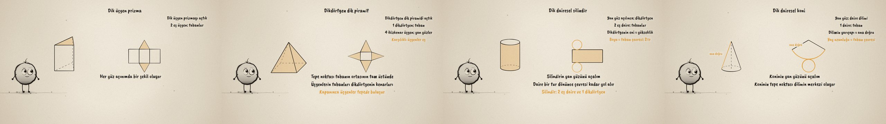

# Açılan Cisimler · Unfolding Solids

**▶ Tarayıcıda izleyin / Watch in the browser:** https://hakanatas.github.io/acilan-cisimler/ 
**⬇ MP4 + altyazılar / MP4 + subtitles:** [Releases](https://github.com/hakanatas/acilan-cisimler/releases) 
**✎ Kullanılan istem / The prompt behind it:** [PROMPT.md](PROMPT.md) 
**🎞 Bütün filmler / All films:** [Nokta'nın Filmleri](https://hakanatas.github.io/nokta-filmleri/?sinif=8)

> **TR —** 8. sınıf matematik "Geometrik Nicelikler" temasındaki MAT.8.4.1 öğrenme çıktısı için hazırlanmış, tamamen JavaScript ile çizilen 92 saniyelik mürekkep animasyonu. Bir cisim kenarlarından kesilip düzleme açılınca hangi şekiller çıkar? Dik üçgen prizmanın açınımında iki eş üçgen taban ve üç dikdörtgen; dikdörtgenlerin enleri taban kenarları, boyları prizmanın yüksekliği. Dikdörtgen dik piramitte bir dikdörtgen taban ve karşılıklı olanları eş dört ikizkenar üçgen. Silindirin yan yüzü, taban dairesi bir tur yuvarlanarak açılıyor: boyu taban çevresi kadar bir dikdörtgen. Koninin yan yüzü bir daire dilimi; yarıçapı ana doğru, yay uzunluğu taban çevresi. Eşleşen yüzler cisimde ve açınımda aynı anda amber renkle yanıyor. Altyazılar Türkçe, İngilizce ya da ikisi birlikte seçilebilir.

A 92-second ink animation for **8th-grade maths**. Nokta, the ink character from [The Learning Ink](https://github.com/hakanatas/the-learning-ink), is the guide again. Each solid is drawn on the left and its net on the right; the matching faces light up amber in both at the same moment, so the relations between the shapes (a rectangle's width is a base edge, the cylinder's rectangle is as long as the circle rolls in one turn, the cone's arc is the base circumference) are seen rather than told.

## Learning outcome

MEB, Türkiye Yüzyılı Maarif Modeli, Ortaokul Matematik, 8th grade, "Geometrik Nicelikler" theme:

**MAT.8.4.1. Dik prizmalar, dikdörtgen dik piramit, dik dairesel silindir ve dik dairesel koninin yüzey açınımlarını çözümleyebilme**
- a) Dik prizmalar, dikdörtgen dik piramit, dik dairesel silindir ve dik dairesel koninin yüzey açınımlarında yer alan şekilleri belirler.
- b) Dik prizmalar, dikdörtgen dik piramit, dik dairesel silindir ve dik dairesel koninin yüzey açınımlarında yer alan şekiller arasındaki ilişkileri belirler.

## Scenes

| # | Time | Scene | What happens | Outcome |
|---|---|---|---|---|
| 1 | 0–10 s | Cisim | What shapes appear when a solid is cut open? | a |
| 2 | 10–28 s | Prizma | Two congruent triangles and three rectangles; widths are the base edges. | a, b |
| 3 | 28–46 s | Piramit | One rectangle and four isosceles triangles, opposite ones congruent. | a, b |
| 4 | 46–64 s | Silindir | A circle rolls one turn: the side is a rectangle 2πr long; two circles. | a, b |
| 5 | 64–80 s | Koni | A sector whose radius is the slant height and whose arc is the base circumference; a circle. | a, b |
| 6 | 80–92 s | Özet | Bases and lateral faces of each solid. | a, b |

## Running it

- **Preview:** double-click `index.html` (it works offline).
- **MP4:** run `npm install` once, then `npm run export -- --format=horizontal --captions=tr`.
- **Subtitles and narration:** `npm run srt` writes `out/captions_*.srt` and `narration_notes.txt`.
- **Editing:**
  - Caption text, timings and narration notes: `captions.js`
  - Everything on screen is drawn by `LI.world(t)` in `scenes/scene1.js` (the solids, the nets, the rolling circle, the words); the other scenes only set the camera.
  - Nokta's poses: `src/draw/film.js`; layout for 16:9 and 9:16: `src/draw/kd.js`

It uses the same engine as The Learning Ink: `renderFrame(t)` as a pure function of time, seeded randomness, and frame-by-frame export.
